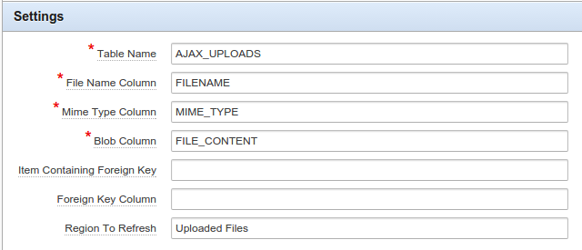

AJAX File Upload
================

This is a plugin for Oracle Application Express, to be able to upload files (with the ability to upload multiple in one hit) using AJAX.

You can find a demo of this plugin in my sample application: https://apex.oracle.com/pls/apex/f?p=14882:22

Installation
==

1. Install the package from src folder
* Import the plugin into your workspace.
* Add an item to your page of type: AJAX File Upload [Plug-in]*

You will need to configure the settings specific to your environment as per the following screenshot:

For the optional settings:

* Item Containing Foreign Key: Here set the page item the value that will go into your foreign key column
* Foreign Key Column: The column from `Table Name` that the foreign key should go to
* Region To Refresh: The title of the region that should be refreshed after file uploads have completed. This queries the apex dictionary, so the title should match exactly (and be unique).

*This plugin does not support IE
